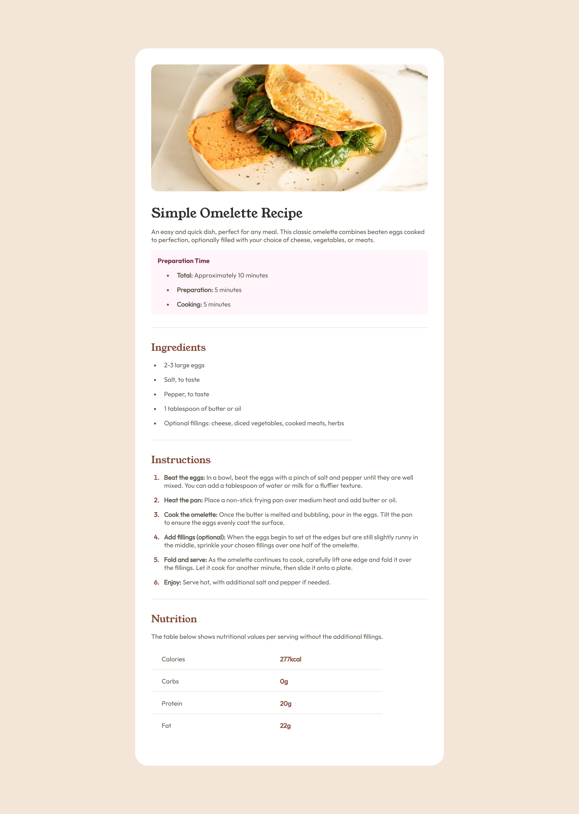

# Frontend Mentor - Recipe page solution

This is a solution to the [Recipe page challenge on Frontend Mentor](https://www.frontendmentor.io/challenges/recipe-page-KiTsR8QQKm). Frontend Mentor challenges help you improve your coding skills by building realistic projects. 

## Table of contents

- [Overview](#overview)
  - [The challenge](#the-challenge)
  - [Screenshot](#screenshot)
  - [Links](#links)
- [My process](#my-process)
  - [Built with](#built-with)
  - [What I learned](#what-i-learned)
  - [Continued development](#continued-development)
  - [Useful resources](#useful-resources)
- [Author](#author)
- [Acknowledgments](#acknowledgments)

## Overview

### Screenshot

### Links

- Solution URL: [My Solution](https://github.com/Ghozy165/Recipe-page)
- Live Site URL: [My Solution](https://recipe-page-wheat-ten.vercel.app/)

## My process

### Built with

- Semantic HTML5 markup
- CSS custom properties
- Flexbox
- Mobile-first workflow

### What I learned

- Structuring HTML following WCAG
- using css more efficent with set property if needed to 

### Continued development

make responsive and following Web Content Accesibility Guide lines

### Useful resources

- [Responsive Web Guide](https://youtu.be/x4u1yp3Msao?si=nMGmuLAqRb11-T2T) - This helped me to have more understanding how to make responsive web

## Author

- Frontend Mentor - [@Ghozy165](https://www.frontendmentor.io/profile/Ghozy165)

## Acknowledgments

Many thanks to Frontend Mentor and Community that has provide platform and inspiration